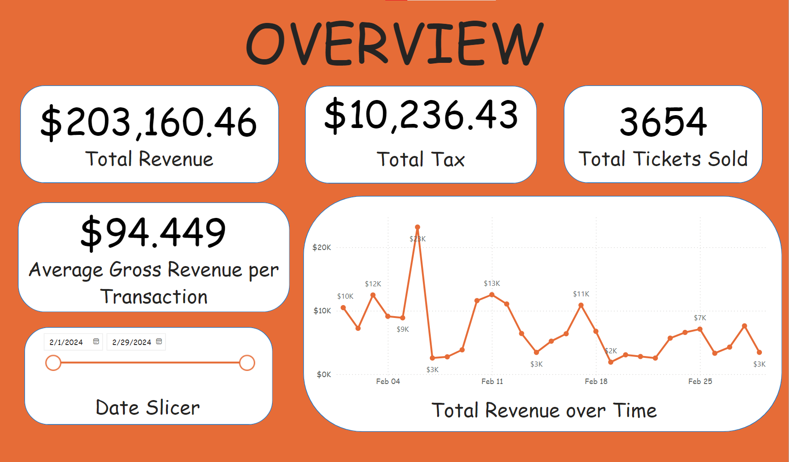

# Revenue-Recognition-Dashboard-in-Power-BI

## About the Project

This project is a Revenue Recognition Dashboard made in Power BI. The aim of this dashboard is to uncover insights as to which source of income is generating the highest revenue.

## Screenshots

    <b>Overview Dashboard</b>

    <b>Revenue Breakdown Dashboard</b>

    <b>Payment and Transaction Dashboard</b>

    <b>Booking Performance Dashboard</b>

## Opening the file

Open the `Revenue Recognition Dashboard.pbix` file in Power BI Desktop.
